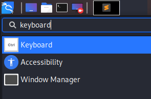
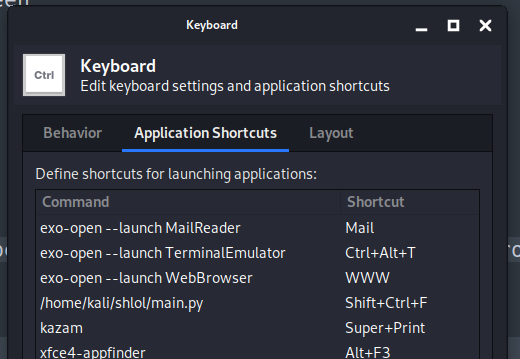
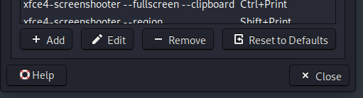
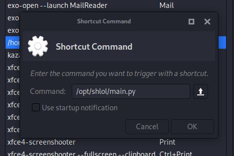

# SHLOL

This is a menu you can trigger with a keybind to do basic stuff for you

- Really easy to use
- Create listeners on the fly
- No copy pasting needed
- Choose the type, IP and PORT and you are done!
- Run remote scripts easily

### Reverse Shell Generator

https://user-images.githubusercontent.com/35298550/119257747-47abd500-bbcf-11eb-934e-29ec617b9435.mp4

### Easily serve scripts and run them remotely

https://user-images.githubusercontent.com/35298550/119358962-c8db9880-bcb1-11eb-853f-d88145d774b3.mp4

# Installation

```diff
- Make sure you have Python3, Pip3, rofi and XTerm installed before proceeding to the installation process!
```

```bash
# I recommend clonning it in the /opt directory!!
# cd /opt
git clone https://github.com/d4rckh/shlol
cd shlol
pip3 install -r requirements.txt
chmod +x main.py
```

# Post-Installation Steps

## Creating directories

- To serve scripts over the network easily using SHLOL you will need to create a new folder where you will place your scripts in: `~/.shlol/scripts`

## Creating the keyboard shortcut

### Kali Linux (XFCE) 

1. Search Keyboard 



2. Go to Shortcuts Menu 



3. Click Add 



4. Type in the path where you installed shlol (the main.py file) and click OK



5. Type in the sequence you want to use to open up shlol

# Are you looking for a really active red teaming community? join the red team lounge: https://discord.gg/68pqHX8UHZ
